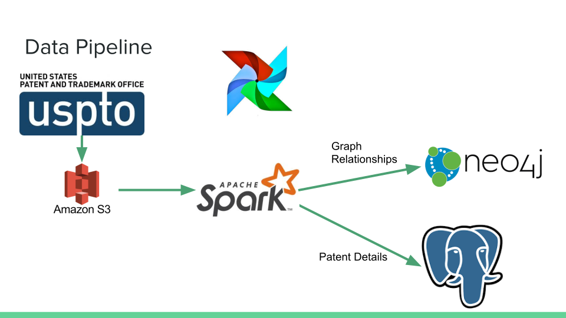

# PATENTLINK

# Table of Contents
1. [Introduction](README.md#introduction)
2. [Approach](README.md#approach)
3. [Requirements](README.md#requirements)
4. [Running the code](README.md#running-the-code)
5. [Troubleshooting configuration issues](README.MD#troubleshooting-configuration-issues)
6. [Testing](README.md#testing)
7. [Author](README.md#author)

# Introduction
Patents determine the exclusive right to produce, market, and sell a design. Patents
can be extraordinarily profitable; for example, the field of pharmaceutical 
patents produces profits in the tens of billions for a single company in a year. 
In order to determine patent infringement or the landscape surrounding a patent, intensive patent reviews or 
[free text searches](https://patents.google.com/) are often used.
In this project, I add another tool to the exploration of patent landscape by creating a pipeline
that processes USPTO files into a front-end network of relationships between patents based on how patents cite each 
other.

# Approach

1. USTPO XML --> AWS S3
2. Apache Spark processing of XML on EC2 Hadoop cluster
    1. Basic patent information to a Postgres database
    2. Relationship information generated from Postgres data stored in Neo4j
3. Front End Visualization of network using neo4j
4. Airflow orchestration of pipeline and weekly updates with new patent XML


# Requirements
Languages:
* Python 3.6

Technologies:
* spark
* PostgreSQL
* Neo4j

Third-Party Libraries:
* AWS CLI
* See the [Requirements File](requirements.txt) for all python requirements.


# Running the Pipeline:
#### Configure aws
```bash
aws configure
```

#### Set-up AWS:
Configure a VPC with a security group and subnet.

#### Provision RDS:
I provisioned it with the AWS UI. Alternatively:
```bash
aws rds create-db-instance --db-instance-identifier $DBNAME --allocated-storage $STORAGE --db-instance-class $INSTANCE  --engine postgres --master-username $USERNAME --master-user-password $PASSWORD
```

#### Provision Neo4J server:
```bash
bash ./src/bash/neo4j_setup.sh
```
Make sure to sign into the web UI and change the default password of "neo4j".
Follow the link: 
```https://$NEO4J_PUBLIC_DNS:7473/browser/```

#### Setup the ENV environment file
Much of the code in this project relies on an environment file. It will also be distriubted to the
cluster so the cluster knows the RDS and Neo4J server information.
Fill in the [.env_template](.env_template) file and rename it locally to .env.

#### Download the data:
```bash
source .env
aws ec2 run-instances --image-id ami-04169656fea786776 --count 1 --instance-type t2.micro --key-name $KEYPAIR --security-group-ids $SECURITY_GROUP --subnet-id $SUBNET --query 'Instances[0].InstanceId'
```
SSH into the ec2 instance and run:
```bash
bash ./src/bash/download_patents.sh
```

#### Spinning up the cluster:
Start a cluster using the open-source tool [Pegasus](https://github.com/InsightDataScience/pegasus).
Configure the master and workers yaml files under ./vars/spark_cluster. Ex. the master file:
```yaml
purchase_type: on_demand
subnet_id: subnet-XXXX
num_instances: 1
key_name: XXXXX-keypair
security_group_ids: sg-XXXXX
instance_type: m4.large
tag_name: spark-cluster
vol_size: 100
role: master
use_eips: true
```
Then start the cluster:
```bash
bash ./src/bash/provision_cluster.sh
```

#### Running the Code:
SSH into the master:
```bash
peg ssh spark-cluster 1
```
 
If you will close your ssh connection during runtime, consider using [screen](https://ss64.com/bash/screen.html):
```bash
screen
```
HINT: Use Ctrl + a + d to detach and leave the session running.

This repository's code can be run with:
```bash
bash ./run.sh
```

After the spark job has finished, there is one additional step to load data into Neo4J.
SSH into the Neo4J ec2 instance, then on the local machine run:
```bash
bash ./src/bash/on_neo4j.sh
```

Finally, enable airflow after the initial data is in RDS and Neo4J. On the master:
```bash
bash ./src/bash/run_airflow.sh
```


# Troubleshooting configuration issues
In the [vars folder](./vars), there are configuration files for spark, hadoop, and airflow. If there is a configuration
error, please consult them for potential differences with your setup.

# Testing
  
Tests can be run by running with:
```bash
bash ./run_tests.sh
``` 

# Author
Created by Stephen J. Wilson